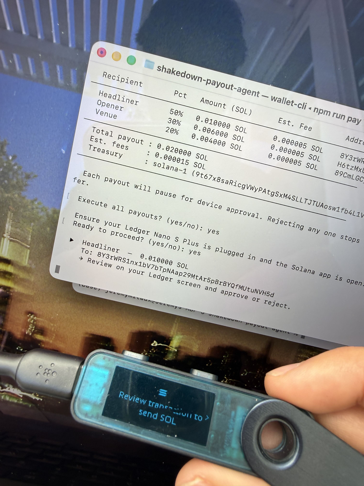
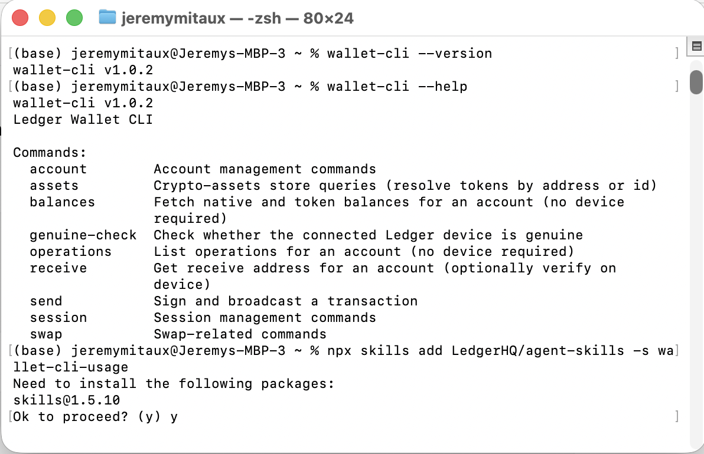

# Shakedown Payout Agent

An AI agent that splits live-show ticket revenue and routes every payout through a Ledger hardware wallet for approval. Built for [Shakedown](https://shakedown.so) — on-chain ticketing for Eugene, OR venues.

> **Disclaimer:** This is a technology demo. Not a financial service. Every transaction requires physical confirmation on a Ledger device. Not investment advice.

---

## The idea

Shakedown handles on-chain ticketing. Money comes in when fans buy tickets, and after the show it needs to go out to the headliner, opener, and venue. That last step — disbursing funds — is exactly the moment you don't want a fully autonomous agent holding the keys.

So I built this: the agent does the math (compute splits, preview fees, assemble transfers) and the Ledger device does the signing. You review each payout on the hardware screen and physically approve or reject it. No approval = nothing broadcast. The private key never leaves the device.

Agent proposes. Hardware disposes.

---

## What it does

1. Reads a `payout.config.json` with show revenue and a split table (artist %, opener %, venue %)
2. Computes each recipient's SOL amount
3. Dry-runs every transfer to preview fees — no device needed for this part
4. Prints a formatted payout plan
5. After you confirm in the terminal, drives `wallet-cli send` for each transfer
6. Each one pauses and shows on the Ledger screen — you approve or reject physically
7. Logs signatures for confirmed transfers; skips anything rejected

---

## Stack

- **Ledger Wallet CLI** (`@ledgerhq/wallet-cli`) — the agentic entry point; assembles and broadcasts transactions
- **Ledger Nano S Plus** — the signer; every transfer is reviewed on-device before broadcast
- **Solana mainnet** — tiny real amounts (~$0.50 total across the demo)
- **TypeScript / Node** — split logic and agent runner

---

## Setup

```bash
# Install the CLI
npm install -g @ledgerhq/wallet-cli

# Clone and install
git clone https://github.com/jeremymitaux/shakedown-payout-agent
cd shakedown-payout-agent
npm install

# Plug in your Ledger, unlock it, open the Solana app
# Discover your accounts
wallet-cli account discover solana
```

Edit `payout.config.json` with your treasury label and recipient addresses:

```json
{
  "show": {
    "name": "Shakedown @ WOW Hall",
    "date": "2026-06-07",
    "venue": "WOW Hall — Eugene, OR"
  },
  "treasury": {
    "label": "solana-1",
    "address": "YOUR_TREASURY_ADDRESS"
  },
  "gross_revenue_sol": 0.02,
  "splits": [
    { "name": "Headliner", "address": "RECIPIENT_1", "pct": 50 },
    { "name": "Opener",    "address": "RECIPIENT_2", "pct": 30 },
    { "name": "Venue",     "address": "RECIPIENT_3", "pct": 20 }
  ]
}
```

---

## Usage

**Preview the plan (no device needed):**
```bash
npm run plan
```

```
────────────────────────────────────────────────────────────────
  SHAKEDOWN PAYOUT PLAN
  Shakedown @ WOW Hall
  2026-06-07 · WOW Hall — Eugene, OR
────────────────────────────────────────────────────────────────
  Recipient       Pct   Amount (SOL)      Est. Fee        Address
────────────────────────────────────────────────────────────────
  Headliner       50%   0.010000 SOL      ~0.000005 SOL   8Y3rWRS1...VH5d
  Opener          30%   0.006000 SOL      ~0.000005 SOL   H6tzMxU4...SzU8
  Venue           20%   0.004000 SOL      ~0.000005 SOL   89CmLGCj...Z69q
────────────────────────────────────────────────────────────────
  Total payout : 0.020000 SOL
  Est. fees    : 0.000015 SOL
────────────────────────────────────────────────────────────────
```

**Execute payouts (device required):**
```bash
npm run pay
```

Each transfer pauses and shows on the Ledger screen. Approve → signed and broadcast. Reject → nothing happens, agent moves on.





---

## The reject demo

If you reject a transfer on the device, the CLI reports it and skips the broadcast. This is the kill-switch — you can stop any individual payout mid-run without affecting the others. The `wallet-cli operations` command afterward confirms nothing went out.

---

## What's real vs. mocked

| Thing | Status |
|---|---|
| Ledger Nano S Plus signing | Real hardware, real USB connection |
| Solana transactions | Real mainnet, real signatures |
| SOL amounts | Tiny (~$0.50 total) — demo expenditure |
| Recipient addresses | All controlled by the demo author |
| Show revenue | Simulated via config — not wired into the live Shakedown app |

The amounts are small on purpose. The point is the signing ceremony, not the numbers. In production this would use the Ledger Multisig CLI for a proper treasury setup.

---

## Future work

- Wire into the live Shakedown ticketing app (real show → real gate revenue → real payout run)
- Ledger Multisig CLI for multi-signer treasury approval
- Multi-currency splits (USDC alongside SOL)

---

Built for the [Ledger Agent Stack](https://developers.ledger.com/docs/ai-tools/overview) bounty. #Sponsored
